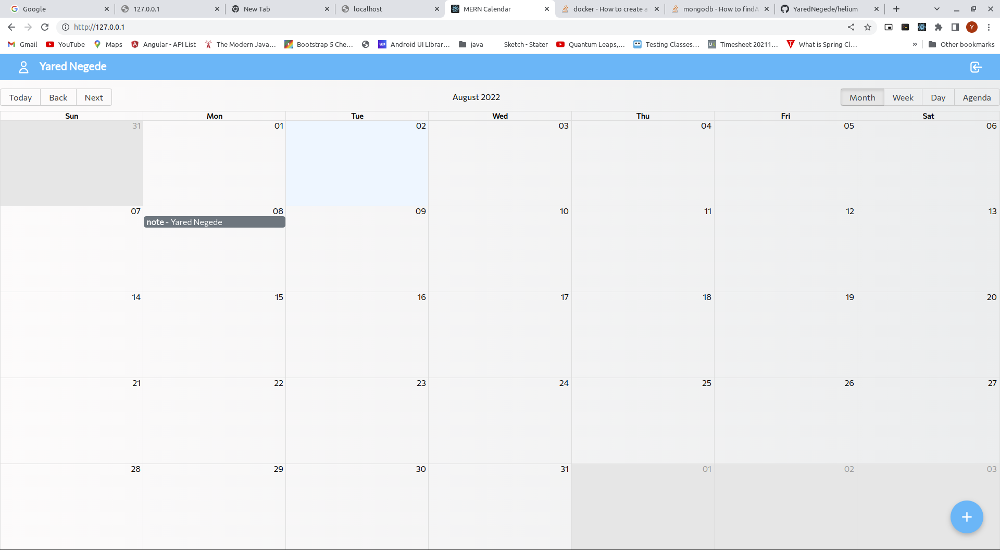
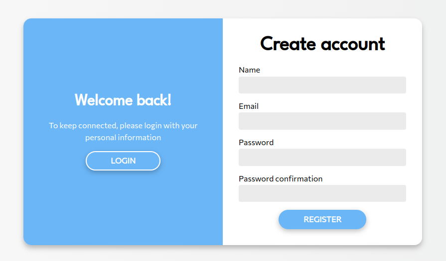
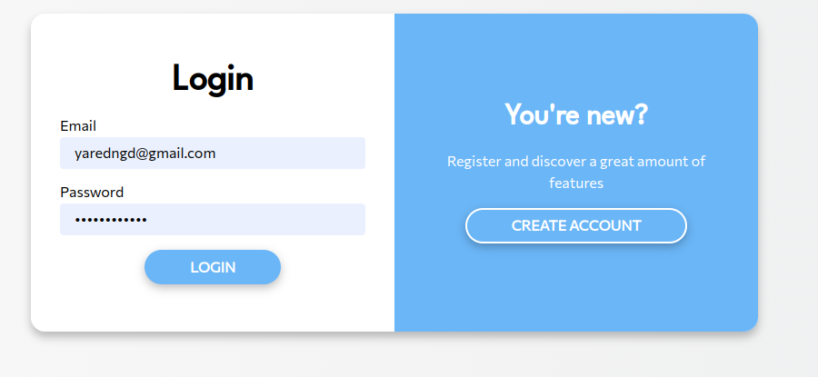

You need to have docker and docker-compsoe installed

got to root folder
docker-compose build
docker-compose up

got to http://127.0.0.1/

register with valid username and password(email and strong password)
login to the system
click th + or double click on any date
put all details and save which you will see it on main page the event

Main Pages

Add event

Other Screen

Register

Login

